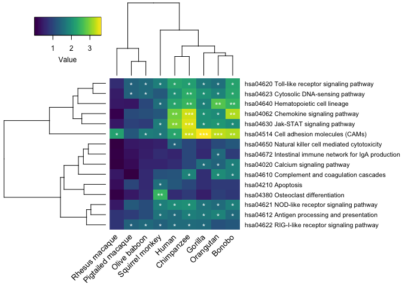

GAGE pathway enrichment\_NHPs and human
================

Purpose
-------

To determine if certain pathways are enriched in NHPs and humans following poly(I:C) transfection.

``` r
library(pathview)
library(gage)
library(gageData)
library(dplyr)
library(tibble)
library(gtools)
library(gplots)
library(ggplot2)
library(purrr)
source("http://bioconductor.org/biocLite.R")
biocLite("org.Hs.eg.db", suppressUpdates = TRUE)
library(org.Hs.eg.db)
library(AnnotationDbi)
data(kegg.gs)
library(reshape2)
library(stringr)
library(viridis)
```

Uploading differential gene expression files

``` r
data_dir <- "DGE_per_species"
sampleFiles <- basename(Sys.glob(file.path(data_dir, "*results.txt")))
sampleNames <- sub('-treated_vs_mock_analysis_results.txt', '', sampleFiles)
length(sampleFiles)
```

    ## [1] 10

``` r
species_match <- str_match(sampleFiles, '(\\w+[\\s]?\\w+)')
species <- species_match[,2]
species
```

    ##  [1] "Bonobo"            "Chimpanzee"        "Gorilla"          
    ##  [4] "Human"             "Mouse"             "Olive baboon"     
    ##  [7] "Orangutan"         "Pigtailed macaque" "Rhesus macaque"   
    ## [10] "Squirrel monkey"

``` r
output_dir <- "GAGE_analysis"
```

Including in the subsetted columns ENTREZ ID (required ID for GAGE), padj, and log2FoldChange. Omitting NA values for these columns and duplicate ENTREZ IDs; taking only the first ENTREZ ID value (i.e. anything after the comma is removed); and finally setting up the data in the appropriate format for GAGE analysis. The mixed order is important for subsequently making a data frame - if the list is left to its own devices, the row order of the first element of the list is the default for the rownames without any compensation to match up the values for the other elements to its respective row.

``` r
read_in_subset <- function(files) {     
  d <- read.delim(files)
  dd <-dplyr::select(d, log2FoldChange, padj, ENTREZID) %>%
    na.omit() %>%
    dplyr::select(log2FoldChange, ENTREZID) %>%
    distinct(ENTREZID, .keep_all = TRUE) 
  dd$ENTREZID <- gsub(pattern = ",.*", replacement = "", dd$ENTREZID)
  e = dd$log2FoldChange
  names(e) = dd$ENTREZID
  ef <- gage(e, gsets = kegg.gs, same.dir = FALSE)
  g <- ef$greater
  gg <- g[mixedorder(rownames(g), decreasing = TRUE),]
}
```

Apply the above function over all the NHP and human DGE files to acquire the GAGE results.

``` r
subset_gageprep <- lapply(file.path(data_dir, sampleFiles[c(1:4, 6:10)]), read_in_subset)
names(subset_gageprep) <- sampleNames[c(1:4, 6:10)]
str(subset_gageprep)
```

    ## List of 9
    ##  $ Bonobo           : num [1:177, 1:6] 0.4416 0.0398 0.2054 0.0132 0.1177 ...
    ##   ..- attr(*, "dimnames")=List of 2
    ##   .. ..$ : chr [1:177] "hsa04977 Vitamin digestion and absorption" "hsa04976 Bile secretion" "hsa04975 Fat digestion and absorption" "hsa04974 Protein digestion and absorption" ...
    ##   .. ..$ : chr [1:6] "p.geomean" "stat.mean" "p.val" "q.val" ...
    ##  $ Chimpanzee       : num [1:177, 1:6] 0.7531 0.0474 0.406 0.0874 0.2821 ...
    ##   ..- attr(*, "dimnames")=List of 2
    ##   .. ..$ : chr [1:177] "hsa04977 Vitamin digestion and absorption" "hsa04976 Bile secretion" "hsa04975 Fat digestion and absorption" "hsa04974 Protein digestion and absorption" ...
    ##   .. ..$ : chr [1:6] "p.geomean" "stat.mean" "p.val" "q.val" ...
    ##  $ Gorilla          : num [1:177, 1:6] 0.469 0.177 0.682 0.152 0.838 ...
    ##   ..- attr(*, "dimnames")=List of 2
    ##   .. ..$ : chr [1:177] "hsa04977 Vitamin digestion and absorption" "hsa04976 Bile secretion" "hsa04975 Fat digestion and absorption" "hsa04974 Protein digestion and absorption" ...
    ##   .. ..$ : chr [1:6] "p.geomean" "stat.mean" "p.val" "q.val" ...
    ##  $ Human            : num [1:177, 1:6] 0.724 0.314 0.271 0.164 0.525 ...
    ##   ..- attr(*, "dimnames")=List of 2
    ##   .. ..$ : chr [1:177] "hsa04977 Vitamin digestion and absorption" "hsa04976 Bile secretion" "hsa04975 Fat digestion and absorption" "hsa04974 Protein digestion and absorption" ...
    ##   .. ..$ : chr [1:6] "p.geomean" "stat.mean" "p.val" "q.val" ...
    ##  $ Olive baboon     : num [1:177, 1:6] 0.67868 0.25081 0.53662 0.00573 0.11843 ...
    ##   ..- attr(*, "dimnames")=List of 2
    ##   .. ..$ : chr [1:177] "hsa04977 Vitamin digestion and absorption" "hsa04976 Bile secretion" "hsa04975 Fat digestion and absorption" "hsa04974 Protein digestion and absorption" ...
    ##   .. ..$ : chr [1:6] "p.geomean" "stat.mean" "p.val" "q.val" ...
    ##  $ Orangutan        : num [1:177, 1:6] 0.6771 0.2317 0.0783 0.12 0.171 ...
    ##   ..- attr(*, "dimnames")=List of 2
    ##   .. ..$ : chr [1:177] "hsa04977 Vitamin digestion and absorption" "hsa04976 Bile secretion" "hsa04975 Fat digestion and absorption" "hsa04974 Protein digestion and absorption" ...
    ##   .. ..$ : chr [1:6] "p.geomean" "stat.mean" "p.val" "q.val" ...
    ##  $ Pigtailed macaque: num [1:177, 1:6] 0.864 0.513 0.875 0.685 0.124 ...
    ##   ..- attr(*, "dimnames")=List of 2
    ##   .. ..$ : chr [1:177] "hsa04977 Vitamin digestion and absorption" "hsa04976 Bile secretion" "hsa04975 Fat digestion and absorption" "hsa04974 Protein digestion and absorption" ...
    ##   .. ..$ : chr [1:6] "p.geomean" "stat.mean" "p.val" "q.val" ...
    ##  $ Rhesus macaque   : num [1:177, 1:6] 0.6433 0.3564 0.6146 0.0289 0.5423 ...
    ##   ..- attr(*, "dimnames")=List of 2
    ##   .. ..$ : chr [1:177] "hsa04977 Vitamin digestion and absorption" "hsa04976 Bile secretion" "hsa04975 Fat digestion and absorption" "hsa04974 Protein digestion and absorption" ...
    ##   .. ..$ : chr [1:6] "p.geomean" "stat.mean" "p.val" "q.val" ...
    ##  $ Squirrel monkey  : num [1:177, 1:6] 0.804 0.71 0.656 0.426 0.489 ...
    ##   ..- attr(*, "dimnames")=List of 2
    ##   .. ..$ : chr [1:177] "hsa04977 Vitamin digestion and absorption" "hsa04976 Bile secretion" "hsa04975 Fat digestion and absorption" "hsa04974 Protein digestion and absorption" ...
    ##   .. ..$ : chr [1:6] "p.geomean" "stat.mean" "p.val" "q.val" ...

Converting the GAGE results into a data frame and then a matrix to create a heatmap.

``` r
gage_form <- lapply(subset_gageprep, data.frame)
gage_df <- do.call("cbind", gage_form) %>%
  rownames_to_column(var = "Pathway") %>%
  dplyr::filter(`Squirrel monkey.q.val` <= 0.05 |
                  Bonobo.q.val <= 0.05 | 
                  `Olive baboon.q.val` <= 0.05 |
                  Chimpanzee.q.val <= 0.05 |
                  Gorilla.q.val <= 0.05 |
                  Human.q.val <= 0.05 |
                  Orangutan.q.val <= 0.05 |
                  `Pigtailed macaque.q.val` <= 0.05 |
                  `Rhesus macaque.q.val` <= 0.05) %>%
  dplyr::select(Pathway, ends_with("q.val"))
head(gage_df)
```

    ##                                                 Pathway Bonobo.q.val
    ## 1 hsa04672 Intestinal immune network for IgA production  0.125416236
    ## 2    hsa04650 Natural killer cell mediated cytotoxicity  0.055120758
    ## 3                   hsa04640 Hematopoietic cell lineage  0.003507689
    ## 4                   hsa04630 Jak-STAT signaling pathway  0.010763344
    ## 5                hsa04623 Cytosolic DNA-sensing pathway  0.005288574
    ## 6        hsa04622 RIG-I-like receptor signaling pathway  0.058825849
    ##   Chimpanzee.q.val Gorilla.q.val Human.q.val Olive baboon.q.val
    ## 1     0.0909859163   0.224036297 0.282853991         0.32373064
    ## 2     0.0909859163   0.192423083 0.038584492         0.34263177
    ## 3     0.0032147646   0.015060976 0.005157060         0.09110334
    ## 4     0.0003618436   0.009158996 0.000981322         0.13406739
    ## 5     0.0042465917   0.009332314 0.009009344         0.03326504
    ## 6     0.0283168047   0.032240263 0.029998413         0.03326504
    ##   Orangutan.q.val Pigtailed macaque.q.val Rhesus macaque.q.val
    ## 1     0.032928314              0.47320806            0.8507651
    ## 2     0.083225465              0.39539090            0.9346773
    ## 3     0.001915543              0.40721477            0.3956530
    ## 4     0.008097308              0.11211069            0.3956530
    ## 5     0.013566306              0.04042959            0.3408315
    ## 6     0.068712890              0.04042959            0.1691194
    ##   Squirrel monkey.q.val
    ## 1            0.22111769
    ## 2            0.29931502
    ## 3            0.02628832
    ## 4            0.01716458
    ## 5            0.05420324
    ## 6            0.03950274

``` r
gage_matrix <- as.matrix(gage_df[,2:10])
rownames(gage_matrix) <- gage_df[,1]
colnames(gage_matrix) <- gsub(pattern = ".q.val", replacement = "", colnames(gage_matrix))
```

To make an output similar to the heatmap GAGE automatically outputs where the -log10(qvalues) for each species are listed. 1.3 = -log10(0.05). As it gets higher, the more significant. \* = -log10 &lt;= 0.05, \*\* when 1.3 &lt; -log10(qvalue) &gt;= 2.3, \*\*\* when 2.3 &lt; -log10(qvalue) &gt;= 3.3

``` r
gage_matrix_log <- -log10(gage_matrix[,1:9])
head(gage_matrix_log)
```

    ##                                                          Bonobo Chimpanzee
    ## hsa04672 Intestinal immune network for IgA production 0.9016462   1.041026
    ## hsa04650 Natural killer cell mediated cytotoxicity    1.2586848   1.041026
    ## hsa04640 Hematopoietic cell lineage                   2.4549789   2.492851
    ## hsa04630 Jak-STAT signaling pathway                   1.9680528   3.441479
    ## hsa04623 Cytosolic DNA-sensing pathway                2.2766614   2.371959
    ## hsa04622 RIG-I-like receptor signaling pathway        1.2304318   1.547956
    ##                                                         Gorilla     Human
    ## hsa04672 Intestinal immune network for IgA production 0.6496816 0.5484377
    ## hsa04650 Natural killer cell mediated cytotoxicity    0.7157428 1.4135872
    ## hsa04640 Hematopoietic cell lineage                   1.8221469 2.2875978
    ## hsa04630 Jak-STAT signaling pathway                   2.0381521 3.0081885
    ## hsa04623 Cytosolic DNA-sensing pathway                2.0300107 2.0453068
    ## hsa04622 RIG-I-like receptor signaling pathway        1.4916014 1.5229017
    ##                                                       Olive baboon
    ## hsa04672 Intestinal immune network for IgA production    0.4898162
    ## hsa04650 Natural killer cell mediated cytotoxicity       0.4651724
    ## hsa04640 Hematopoietic cell lineage                      1.0404657
    ## hsa04630 Jak-STAT signaling pathway                      0.8726768
    ## hsa04623 Cytosolic DNA-sensing pathway                   1.4780119
    ## hsa04622 RIG-I-like receptor signaling pathway           1.4780119
    ##                                                       Orangutan
    ## hsa04672 Intestinal immune network for IgA production  1.482431
    ## hsa04650 Natural killer cell mediated cytotoxicity     1.079744
    ## hsa04640 Hematopoietic cell lineage                    2.717708
    ## hsa04630 Jak-STAT signaling pathway                    2.091659
    ## hsa04623 Cytosolic DNA-sensing pathway                 1.867538
    ## hsa04622 RIG-I-like receptor signaling pathway         1.162962
    ##                                                       Pigtailed macaque
    ## hsa04672 Intestinal immune network for IgA production         0.3249479
    ## hsa04650 Natural killer cell mediated cytotoxicity            0.4029733
    ## hsa04640 Hematopoietic cell lineage                           0.3901765
    ## hsa04630 Jak-STAT signaling pathway                           0.9503530
    ## hsa04623 Cytosolic DNA-sensing pathway                        1.3933006
    ## hsa04622 RIG-I-like receptor signaling pathway                1.3933006
    ##                                                       Rhesus macaque
    ## hsa04672 Intestinal immune network for IgA production     0.07019036
    ## hsa04650 Natural killer cell mediated cytotoxicity        0.02933832
    ## hsa04640 Hematopoietic cell lineage                       0.40268555
    ## hsa04630 Jak-STAT signaling pathway                       0.40268555
    ## hsa04623 Cytosolic DNA-sensing pathway                    0.46746026
    ## hsa04622 RIG-I-like receptor signaling pathway            0.77180655
    ##                                                       Squirrel monkey
    ## hsa04672 Intestinal immune network for IgA production       0.6553765
    ## hsa04650 Natural killer cell mediated cytotoxicity          0.5238715
    ## hsa04640 Hematopoietic cell lineage                         1.5802372
    ## hsa04630 Jak-STAT signaling pathway                         1.7653668
    ## hsa04623 Cytosolic DNA-sensing pathway                      1.2659748
    ## hsa04622 RIG-I-like receptor signaling pathway              1.4033728

Heat map of this new matrix

``` r
##This is the output of the heatmap
heatmap.2(gage_matrix_log, key.title = "", srtCol = 45, 
          trace="none",  col = viridis(100), 
          cexRow = 0.8, cexCol = 1, dendrogram = c("both"), margin=c(6, 17), 
          density.info = "none", offsetRow = 0.01, offsetCol = 0.01, 
          cellnote = ifelse(gage_matrix_log >= 1.3 & gage_matrix_log < 2.3, "*", ifelse(gage_matrix_log < 3.3 & gage_matrix_log >= 2.3, "**", ifelse(gage_matrix_log >= 3.3, "***", NA))), notecol = "white", labRow = NULL)
```



``` r
##Here we are simply saving the heatmap to a file. Note that the only difference in the code from above is that we set the keysize = 0.99 here for aesthetics sake.
png(file = file.path(output_dir, paste(Sys.Date(), "JMG neglog10 pvalue primates_clustered.png")), units = 'in', height = 7, width = 7, res = 300)
heatmap.2(gage_matrix_log, key.title = "", keysize = 0.99, srtCol = 45, 
          trace="none",  col = viridis(100), 
          cexRow = 0.8, cexCol = 1, dendrogram = c("both"), margin=c(6, 17), 
          density.info = "none", offsetRow = 0.01, offsetCol = 0.01, 
          cellnote = ifelse(gage_matrix_log >= 1.3 & gage_matrix_log < 2.3, "*", ifelse(gage_matrix_log < 3.3 & gage_matrix_log >= 2.3, "**", ifelse(gage_matrix_log >= 3.3, "***", NA))),
          notecol = "white", labRow = NULL)
dev.off()
```

    ## quartz_off_screen 
    ##                 2

Now creating tables for each species of the DGE profiles used for the GAGE analysis, i.e. na.omit() on any row where the log2FoldChange, padj, or ENTREZID are missing. Including SYMBOL as one of the columns for ease of annotating heat maps/for reference.

``` r
expression_profile <- function(files) {     
  d <- read.delim(files)
  dd <-dplyr::select(d, log2FoldChange, padj, ENTREZID, SYMBOL) %>%
    na.omit(d, log2FoldChange, padj, ENTREZID) %>%
    dplyr::select(log2FoldChange, ENTREZID, SYMBOL) %>%
    distinct(ENTREZID, .keep_all = TRUE) 
}

expression_NHPs <- lapply(file.path(data_dir, sampleFiles[c(1:4, 6:10)]), expression_profile)
names(expression_NHPs) <- sampleNames[c(1:4, 6:10)]
str(expression_NHPs)
```

    ## List of 9
    ##  $ Bonobo           :'data.frame':   15377 obs. of  3 variables:
    ##   ..$ log2FoldChange: num [1:15377] 9.82 9.53 8.8 8.76 8.63 ...
    ##   ..$ ENTREZID      : Factor w/ 25129 levels "1","10","100",..: 18907 12795 12788 23492 23590 5551 24136 12827 12471 16597 ...
    ##   ..$ SYMBOL        : Factor w/ 25129 levels "A1BG","A1BG-AS1",..: 4216 4215 8255 15899 22815 6820 19341 8643 8278 7720 ...
    ##   ..- attr(*, "na.action")=Class 'omit'  Named int [1:49749] 158 188 195 265 407 479 492 566 676 691 ...
    ##   .. .. ..- attr(*, "names")= chr [1:49749] "158" "188" "195" "265" ...
    ##  $ Chimpanzee       :'data.frame':   16378 obs. of  3 variables:
    ##   ..$ log2FoldChange: num [1:16378] 9.33 9.31 9.06 8.82 8.78 ...
    ##   ..$ ENTREZID      : Factor w/ 25129 levels "1","10","100",..: 23492 24136 16597 14733 15028 15034 15039 24676 6231 24780 ...
    ##   ..$ SYMBOL        : Factor w/ 25129 levels "A1BG","A1BG-AS1",..: 15899 19341 7720 14919 15896 15897 15898 2919 3611 8642 ...
    ##   ..- attr(*, "na.action")=Class 'omit'  Named int [1:48722] 105 195 208 370 371 475 590 701 740 798 ...
    ##   .. .. ..- attr(*, "names")= chr [1:48722] "105" "195" "208" "370" ...
    ##  $ Gorilla          :'data.frame':   14969 obs. of  3 variables:
    ##   ..$ log2FoldChange: num [1:14969] 9.52 9 2.64 4.58 5.13 ...
    ##   ..$ ENTREZID      : Factor w/ 25129 levels "1","10","100",..: 23492 12471 7581 10058 1952 12088 12482 24097 23981 20530 ...
    ##   ..$ SYMBOL        : Factor w/ 25129 levels "A1BG","A1BG-AS1",..: 15899 8278 20516 19487 8419 1665 8279 4552 721 22405 ...
    ##   ..- attr(*, "na.action")=Class 'omit'  Named int [1:50169] 57 78 109 163 170 321 475 485 501 505 ...
    ##   .. .. ..- attr(*, "names")= chr [1:50169] "57" "78" "109" "163" ...
    ##  $ Human            :'data.frame':   15246 obs. of  3 variables:
    ##   ..$ log2FoldChange: num [1:15246] 10.58 9.39 9.06 8.67 7.92 ...
    ##   ..$ ENTREZID      : Factor w/ 25129 levels "1","10","100",..: 24136 14733 12471 6231 5551 16597 9440 12482 7230 5306 ...
    ##   ..$ SYMBOL        : Factor w/ 25129 levels "A1BG","A1BG-AS1",..: 19341 14919 8278 3611 6820 7720 4548 8279 4175 23756 ...
    ##   ..- attr(*, "na.action")=Class 'omit'  Named int [1:49863] 173 213 244 321 324 339 402 409 435 471 ...
    ##   .. .. ..- attr(*, "names")= chr [1:49863] "173" "213" "244" "321" ...
    ##  $ Olive baboon     :'data.frame':   14520 obs. of  3 variables:
    ##   ..$ log2FoldChange: num [1:14520] 9.89 9.62 8.91 8.88 7.26 ...
    ##   ..$ ENTREZID      : Factor w/ 25129 levels "1","10","100",..: 23492 18907 15028 15034 19045 14733 12482 14735 6231 12471 ...
    ##   ..$ SYMBOL        : Factor w/ 25129 levels "A1BG","A1BG-AS1",..: 15899 4216 15896 15897 8275 14919 8279 14920 3611 8278 ...
    ##   ..- attr(*, "na.action")=Class 'omit'  Named int [1:50640] 65 112 161 250 277 310 481 564 568 625 ...
    ##   .. .. ..- attr(*, "names")= chr [1:50640] "65" "112" "161" "250" ...
    ##  $ Orangutan        :'data.frame':   14382 obs. of  3 variables:
    ##   ..$ log2FoldChange: num [1:14382] 8.7 8.53 7.71 7.02 6.86 ...
    ##   ..$ ENTREZID      : Factor w/ 25129 levels "1","10","100",..: 15439 19045 16597 18906 6231 12482 9440 10058 16035 12744 ...
    ##   ..$ SYMBOL        : Factor w/ 25129 levels "A1BG","A1BG-AS1",..: 7719 8275 7720 4225 3611 8279 4548 19487 17382 8394 ...
    ##   ..- attr(*, "na.action")=Class 'omit'  Named int [1:50778] 15 93 148 158 183 243 303 319 342 376 ...
    ##   .. .. ..- attr(*, "names")= chr [1:50778] "15" "93" "148" "158" ...
    ##  $ Pigtailed macaque:'data.frame':   14551 obs. of  3 variables:
    ##   ..$ log2FoldChange: num [1:14551] 9.31 7.45 7.41 7.21 5.85 ...
    ##   ..$ ENTREZID      : Factor w/ 25129 levels "1","10","100",..: 14733 6231 15034 19045 9440 23384 16320 21459 15039 19479 ...
    ##   ..$ SYMBOL        : Factor w/ 25129 levels "A1BG","A1BG-AS1",..: 14919 3611 15897 8275 4548 7703 16630 4712 15898 16629 ...
    ##   ..- attr(*, "na.action")=Class 'omit'  Named int [1:50612] 48 132 140 144 170 260 297 362 402 423 ...
    ##   .. .. ..- attr(*, "names")= chr [1:50612] "48" "132" "140" "144" ...
    ##  $ Rhesus macaque   :'data.frame':   13173 obs. of  3 variables:
    ##   ..$ log2FoldChange: num [1:13173] 8.75 7.45 6.76 6.25 5.99 ...
    ##   ..$ ENTREZID      : Factor w/ 25129 levels "1","10","100",..: 14733 15034 17045 12482 12471 19045 9440 23384 15039 7211 ...
    ##   ..$ SYMBOL        : Factor w/ 25129 levels "A1BG","A1BG-AS1",..: 14919 15897 4551 8279 8278 8275 4548 7703 15898 5071 ...
    ##   ..- attr(*, "na.action")=Class 'omit'  Named int [1:52004] 50 52 66 122 149 199 328 347 435 436 ...
    ##   .. .. ..- attr(*, "names")= chr [1:52004] "50" "52" "66" "122" ...
    ##  $ Squirrel monkey  :'data.frame':   13046 obs. of  3 variables:
    ##   ..$ log2FoldChange: num [1:13046] 7.91 7.62 6.34 5.43 5.37 ...
    ##   ..$ ENTREZID      : Factor w/ 25129 levels "1","10","100",..: 19045 12471 10311 9440 19998 10058 17045 20027 13627 14747 ...
    ##   ..$ SYMBOL        : Factor w/ 25129 levels "A1BG","A1BG-AS1",..: 8275 8278 6816 4548 23047 19487 4551 21575 9617 14950 ...
    ##   ..- attr(*, "na.action")=Class 'omit'  Named int [1:52143] 8 126 140 162 188 209 258 291 306 320 ...
    ##   .. .. ..- attr(*, "names")= chr [1:52143] "8" "126" "140" "162" ...

``` r
for (i in names(expression_NHPs)){
  filename <- paste(i,  "DGE profile for GAGE.txt", sep="")
  write.table(expression_NHPs[[i]], file = file.path(output_dir, filename),row.names=FALSE,sep="\t",quote=FALSE)
}

##To see the number of genes included in the GAGE analysis per species 
lapply(expression_NHPs, nrow)
```

    ## $Bonobo
    ## [1] 15377
    ## 
    ## $Chimpanzee
    ## [1] 16378
    ## 
    ## $Gorilla
    ## [1] 14969
    ## 
    ## $Human
    ## [1] 15246
    ## 
    ## $`Olive baboon`
    ## [1] 14520
    ## 
    ## $Orangutan
    ## [1] 14382
    ## 
    ## $`Pigtailed macaque`
    ## [1] 14551
    ## 
    ## $`Rhesus macaque`
    ## [1] 13173
    ## 
    ## $`Squirrel monkey`
    ## [1] 13046

Session Info

``` r
sessionInfo()
```

    ## R version 3.3.3 (2017-03-06)
    ## Platform: x86_64-apple-darwin13.4.0 (64-bit)
    ## Running under: macOS Sierra 10.12.6
    ## 
    ## locale:
    ## [1] en_US.UTF-8/en_US.UTF-8/en_US.UTF-8/C/en_US.UTF-8/en_US.UTF-8
    ## 
    ## attached base packages:
    ## [1] parallel  stats4    stats     graphics  grDevices utils     datasets 
    ## [8] methods   base     
    ## 
    ## other attached packages:
    ##  [1] bindrcpp_0.2         viridis_0.4.0        viridisLite_0.2.0   
    ##  [4] stringr_1.2.0        reshape2_1.4.2       BiocInstaller_1.22.3
    ##  [7] purrr_0.2.2          ggplot2_2.2.1        gplots_3.0.1        
    ## [10] gtools_3.5.0         tibble_1.3.3         dplyr_0.7.3         
    ## [13] gageData_2.10.0      gage_2.22.0          pathview_1.12.0     
    ## [16] org.Hs.eg.db_3.3.0   AnnotationDbi_1.34.4 IRanges_2.6.1       
    ## [19] S4Vectors_0.10.3     Biobase_2.32.0       BiocGenerics_0.18.0 
    ## 
    ## loaded via a namespace (and not attached):
    ##  [1] KEGGREST_1.12.3    colorspace_1.3-2   htmltools_0.3.5   
    ##  [4] yaml_2.1.14        XML_3.98-1.9       rlang_0.1.2       
    ##  [7] glue_1.1.1         DBI_0.6-1          Rgraphviz_2.16.0  
    ## [10] bindr_0.1          plyr_1.8.4         zlibbioc_1.18.0   
    ## [13] Biostrings_2.40.2  munsell_0.4.3      gtable_0.2.0      
    ## [16] caTools_1.17.1     memoise_1.0.0      evaluate_0.10     
    ## [19] knitr_1.16         Rcpp_0.12.10       KernSmooth_2.23-15
    ## [22] backports_1.0.5    scales_0.4.1       gdata_2.17.0      
    ## [25] graph_1.50.0       XVector_0.12.1     gridExtra_2.2.1   
    ## [28] png_0.1-7          digest_0.6.12      stringi_1.1.5     
    ## [31] grid_3.3.3         rprojroot_1.2      tools_3.3.3       
    ## [34] bitops_1.0-6       magrittr_1.5       lazyeval_0.2.0    
    ## [37] RSQLite_1.1-2      pkgconfig_2.0.1    KEGGgraph_1.30.0  
    ## [40] assertthat_0.2.0   rmarkdown_1.4      httr_1.2.1        
    ## [43] R6_2.2.0
