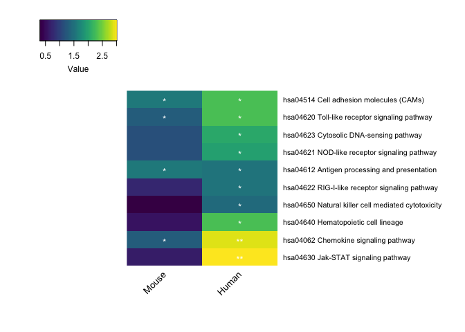

GAGE pathway enrichment\_mouse
================

Purpose
-------

To determine if certain pathways are enriched in mice following poly(I:C) transfection.

``` r
library(pathview)
library(gage)
library(gageData)
library(dplyr)
library(tibble)
library(ggplot2)
library(gplots)
library(gtools)
library(tibble)
source("http://bioconductor.org/biocLite.R")
biocLite("org.Mm.eg.db", suppressUpdates = TRUE)
library(org.Mm.eg.db)
library(AnnotationDbi)
data(kegg.sets.mm)
data(sigmet.idx.mm)
biocLite("org.Hs.eg.db", suppressUpdates = TRUE)
library(org.Hs.eg.db)
data(kegg.gs)
kegg.sets.mm.s = kegg.sets.mm[sigmet.idx.mm]
head(kegg.sets.mm, 3)
```

    ## $`mmu04144 Endocytosis`
    ##   [1] "100017"    "100039024" "100044874" "100045864" "103967"   
    ##   [6] "106572"    "106952"    "107305"    "107568"    "109689"   
    ##  [11] "110355"    "110557"    "110696"    "11554"     "11555"    
    ##  [16] "11556"     "116733"    "11771"     "11772"     "11773"    
    ##  [21] "11845"     "11848"     "12389"     "12390"     "12391"    
    ##  [26] "12402"     "12540"     "12757"     "12765"     "12767"    
    ##  [31] "12774"     "12978"     "13132"     "13196"     "13429"    
    ##  [36] "13430"     "13645"     "13649"     "13660"     "13854"    
    ##  [41] "13855"     "13858"     "13867"     "13869"     "140500"   
    ##  [46] "14062"     "14183"     "14184"     "14186"     "14254"    
    ##  [51] "14275"     "14276"     "14772"     "14773"     "14963"    
    ##  [56] "14964"     "14972"     "14985"     "14990"     "14991"    
    ##  [61] "14997"     "15006"     "15007"     "15013"     "15018"    
    ##  [66] "15019"     "15024"     "15039"     "15040"     "15042"    
    ##  [71] "15043"     "15051"     "15239"     "15461"     "15481"    
    ##  [76] "15482"     "15511"     "15512"     "16001"     "16184"    
    ##  [81] "16185"     "16186"     "16396"     "16542"     "16590"    
    ##  [86] "16835"     "17126"     "17127"     "17130"     "17131"    
    ##  [91] "17246"     "17295"     "17999"     "18211"     "18571"    
    ##  [96] "18595"     "18717"     "18719"     "18720"     "18759"    
    ## [101] "18762"     "18805"     "18806"     "18854"     "19326"    
    ## [106] "19334"     "19341"     "19344"     "19345"     "19349"    
    ## [111] "193740"    "194309"    "19713"     "20404"     "20405"    
    ## [116] "20408"     "20479"     "20779"     "208092"    "20844"    
    ## [121] "208650"    "211914"    "212285"    "213990"    "215445"   
    ## [126] "215632"    "216238"    "216439"    "216724"    "216859"   
    ## [131] "216869"    "216963"    "21803"     "21808"     "21809"    
    ## [136] "21812"     "21813"     "218441"    "22034"     "22042"    
    ## [141] "22088"     "22365"     "224753"    "224754"    "224756"   
    ## [146] "224761"    "227288"    "227700"    "227733"    "228998"   
    ## [151] "230597"    "230837"    "232227"    "232910"    "234353"   
    ## [156] "234852"    "24013"     "243621"    "245666"    "259300"   
    ## [161] "26385"     "26431"     "268451"    "271457"    "27681"    
    ## [166] "28084"     "330192"    "333715"    "347722"    "399549"   
    ## [171] "433749"    "52055"     "52348"     "53869"     "54189"    
    ## [176] "54673"     "547349"    "56324"     "56513"     "57440"    
    ## [181] "58194"     "58220"     "64931"     "66201"     "66251"    
    ## [186] "66313"     "66371"     "66700"     "66914"     "67028"    
    ## [191] "67064"     "67300"     "67588"     "68942"     "68953"    
    ## [196] "69710"     "69780"     "70160"     "70527"     "71770"    
    ## [201] "71889"     "72543"     "72685"     "73711"     "73728"    
    ## [206] "74002"     "74006"     "74325"     "74998"     "75608"    
    ## [211] "75767"     "75788"     "76959"     "77038"     "78287"    
    ## [216] "78618"     "80794"     "83814"     "84092"     "93737"    
    ## [221] "93742"     "98366"     "98878"    
    ## 
    ## $`mmu03008 Ribosome biogenesis in eukaryotes`
    ##  [1] "100019"    "100044829" "100045148" "100045968" "100045999"
    ##  [6] "100047957" "100503708" "100505330" "101592"    "102462"   
    ## [11] "102614"    "103573"    "104444"    "105372"    "108143"   
    ## [16] "110816"    "117109"    "12995"     "13000"     "13001"    
    ## [21] "14000"     "14113"     "14791"     "16418"     "170722"   
    ## [26] "17724"     "17725"     "19384"     "19428"     "195434"   
    ## [31] "20826"     "208366"    "213773"    "213895"    "21453"    
    ## [36] "216987"    "217109"    "21771"     "217995"    "224092"   
    ## [41] "225348"    "227522"    "230082"    "230737"    "237082"   
    ## [46] "237107"    "24127"     "24128"     "245474"    "245610"   
    ## [51] "269470"    "27993"     "30877"     "434401"    "52530"    
    ## [56] "53319"     "54364"     "55989"     "56488"     "57815"    
    ## [61] "59028"     "633406"    "633966"    "66161"     "66181"    
    ## [66] "66711"     "66932"     "67045"     "67134"     "67459"    
    ## [71] "67619"     "67724"     "67973"     "68147"     "68272"    
    ## [76] "69237"     "69961"     "71340"     "72515"     "72554"    
    ## [81] "73674"     "73736"     "74097"     "74778"     "75471"    
    ## [86] "83454"     "97112"     "98956"    
    ## 
    ## $`mmu04141 Protein processing in endoplasmic reticulum`
    ##   [1] "100037258" "100041121" "100042561" "100043027" "100043039"
    ##   [6] "100046078" "100046302" "100504754" "103963"    "105245"   
    ##  [11] "107513"    "108687"    "109815"    "110379"    "110616"   
    ##  [16] "116891"    "11911"     "12017"     "12018"     "12028"    
    ##  [21] "12043"     "12282"     "12304"     "12317"     "12330"    
    ##  [26] "12333"     "12334"     "12364"     "12915"     "12954"    
    ##  [31] "12955"     "13002"     "13135"     "13198"     "13200"    
    ##  [36] "13418"     "13665"     "13666"     "140499"    "140740"   
    ##  [41] "14376"     "14827"     "14828"     "15467"     "15481"    
    ##  [46] "15482"     "15502"     "15505"     "15511"     "15512"    
    ##  [51] "15516"     "15519"     "16430"     "17155"     "17156"    
    ##  [56] "17872"     "18024"     "18415"     "18453"     "18786"    
    ##  [61] "19089"     "19106"     "192193"    "19358"     "19359"    
    ##  [66] "193740"    "20014"     "20224"     "20334"     "20335"    
    ##  [71] "20338"     "20832"     "213539"    "21402"     "216080"   
    ##  [76] "216197"    "216440"    "217365"    "218793"    "218811"   
    ##  [81] "22027"     "22030"     "22193"     "22194"     "22213"    
    ##  [86] "22230"     "223455"    "22393"     "22433"     "226418"   
    ##  [91] "226641"    "227619"    "230815"    "230904"    "231098"   
    ##  [96] "235416"    "23802"     "240667"    "244178"    "244179"   
    ## [101] "26400"     "26408"     "26414"     "26419"     "26420"    
    ## [106] "269523"    "26965"     "27054"     "27061"     "270669"   
    ## [111] "27103"     "320011"    "386649"    "50527"     "50762"    
    ## [116] "50873"     "50907"     "53421"     "54197"     "54609"    
    ## [121] "56085"     "56228"     "56424"     "56438"     "56445"    
    ## [126] "56453"     "56550"     "56709"     "56812"     "57377"    
    ## [131] "57743"     "59007"     "632883"    "63958"     "64209"    
    ## [136] "66105"     "66212"     "66245"     "66256"     "66326"    
    ## [141] "66397"     "66435"     "66530"     "66753"     "66861"    
    ## [146] "66890"     "66967"     "67128"     "67397"     "67437"    
    ## [151] "67475"     "67819"     "67838"     "68292"     "69162"    
    ## [156] "69276"     "69608"     "70361"     "70377"     "71853"    
    ## [161] "72265"     "74126"     "75744"     "77371"     "78943"    
    ## [166] "80286"     "81489"     "81500"     "81910"     "94232"    
    ## [171] "99683"

``` r
library(reshape2)
library(viridisLite)
library(stringr)
```

Uploading differential gene expression files

``` r
data_dir <- "DGE_per_species"
sampleFiles <- basename(Sys.glob(file.path(data_dir, "*results.txt")))
sampleNames <- sub('-treated_vs_mock_analysis_results.txt', '', sampleFiles)
length(sampleFiles)
```

    ## [1] 10

``` r
species_match <- str_match(sampleFiles, '(\\w+[\\s]?\\w+)')
species <- species_match[,2]
species
```

    ##  [1] "Bonobo"            "Chimpanzee"        "Gorilla"          
    ##  [4] "Human"             "Mouse"             "Olive baboon"     
    ##  [7] "Orangutan"         "Pigtailed macaque" "Rhesus macaque"   
    ## [10] "Squirrel monkey"

``` r
output_dir <- "GAGE_mouse_analysis"
```

Including in the subsetted columns ENTREZ ID (required ID for GAGE), padj, and log2FoldChange. Omitting NA values for these columns and duplicate ENTREZ IDs; taking only the first ENTREZ ID value (i.e. anything after the comma is removed); and finally setting up the data in the appropriate format for GAGE analysis. The mixed order is important for subsequently making a data frame - if the list is left to its own devices, the row order of the first element of the list is the default for the rownames without any compensation to match up the values for the other elements to its respective row.

``` r
##For mouse
read_in_subset_mouse <- function(files) {     
  d <- read.delim(files)
  dd <-select(d, log2FoldChange, padj, ENTREZID) %>%
    na.omit() %>%
    select(log2FoldChange, ENTREZID) %>%
    distinct(ENTREZID, .keep_all = TRUE) 
  dd$ENTREZID <- gsub(pattern = ",.*", replacement = "", dd$ENTREZID)
  e = dd$log2FoldChange
  names(e) = dd$ENTREZID
  ef <- gage(e, gsets = kegg.sets.mm.s, same.dir = FALSE)
  g <- ef$greater
  gg <- g[mixedorder(rownames(g), decreasing = TRUE),]
}

##For human since the final figure will be a side by side of human and mouse pathways
read_in_subset_human <- function(files) {     
  d <- read.delim(files)
  dd <-select(d, log2FoldChange, padj, ENTREZID) %>%
    na.omit() %>%
    select(log2FoldChange, ENTREZID) %>%
    distinct(ENTREZID, .keep_all = TRUE) 
  dd$ENTREZID <- gsub(pattern = ",.*", replacement = "", dd$ENTREZID)
  e = dd$log2FoldChange
  names(e) = dd$ENTREZID
  ef <- gage(e, gsets = kegg.gs, same.dir = FALSE)
  g <- ef$greater
  gg <- g[mixedorder(rownames(g), decreasing = TRUE),]
}
```

Apply the above functions to mouse and human DGE files respectively to acquire the GAGE results.

``` r
human_gageprep <- lapply(file.path(data_dir, sampleFiles[c(4)]), read_in_subset_human)
names(human_gageprep) <- sampleNames[c(4)]

mouse_gageprep <- lapply(file.path(data_dir, sampleFiles[c(5)]), read_in_subset_mouse)
names(mouse_gageprep) <- sampleNames[c(5)]
```

Converting the GAGE results for each species into a data frame and then putting them together to use for generating a matrix that we can then create a heat map from.

``` r
##Mouse 
gage_mouse_form <- lapply(mouse_gageprep, data.frame)
gage_mouse_df <- do.call("cbind", gage_mouse_form) %>%
  rownames_to_column(var = "Pathway") %>%
  rename(`Mouse pathway` = Pathway)

##Human
gage_human_form <- lapply(human_gageprep, data.frame)
gage_human_df <- do.call("cbind", gage_human_form) %>%
  rownames_to_column(var = "Pathway") %>%
  cbind(gage_mouse_df) %>%
  dplyr::filter(Human.q.val <= 0.05) %>%
  select(Pathway, `Mouse pathway`, ends_with("q.val")) 
write.csv(gage_human_df, file = file.path(output_dir, paste(Sys.Date(), "JMG mouse human pathways.csv")))
gage_human_df
```

    ##                                               Pathway
    ## 1  hsa04650 Natural killer cell mediated cytotoxicity
    ## 2                 hsa04640 Hematopoietic cell lineage
    ## 3                 hsa04630 Jak-STAT signaling pathway
    ## 4              hsa04623 Cytosolic DNA-sensing pathway
    ## 5      hsa04622 RIG-I-like receptor signaling pathway
    ## 6        hsa04621 NOD-like receptor signaling pathway
    ## 7       hsa04620 Toll-like receptor signaling pathway
    ## 8        hsa04612 Antigen processing and presentation
    ## 9             hsa04514 Cell adhesion molecules (CAMs)
    ## 10               hsa04062 Chemokine signaling pathway
    ##                                         Mouse pathway Human.q.val
    ## 1  mmu04650 Natural killer cell mediated cytotoxicity 0.038584492
    ## 2                 mmu04640 Hematopoietic cell lineage 0.005157060
    ## 3                 mmu04630 Jak-STAT signaling pathway 0.000981322
    ## 4              mmu04623 Cytosolic DNA-sensing pathway 0.009009344
    ## 5      mmu04622 RIG-I-like receptor signaling pathway 0.029998413
    ## 6        mmu04621 NOD-like receptor signaling pathway 0.010884169
    ## 7       mmu04620 Toll-like receptor signaling pathway 0.005238406
    ## 8        mmu04612 Antigen processing and presentation 0.029998413
    ## 9             mmu04514 Cell adhesion molecules (CAMs) 0.005157060
    ## 10               mmu04062 Chemokine signaling pathway 0.001310612
    ##    Mouse.q.val
    ## 1   0.49776050
    ## 2   0.27278719
    ## 3   0.22902878
    ## 4   0.06839161
    ## 5   0.17401907
    ## 6   0.07211020
    ## 7   0.04992488
    ## 8   0.02627987
    ## 9   0.02627987
    ## 10  0.04992488

``` r
gage_mousehuman_matrix <- as.matrix(gage_human_df[c(3, 4)])
rownames(gage_mousehuman_matrix) <- gage_human_df[,1]
colnames(gage_mousehuman_matrix) <- c("Human", "Mouse")
```

To make an output similar to the heatmap GAGE automatically outputs where the -log10(qvalues) for each species are listed. 1.3 = -log10(0.05). As it gets higher, the more significant. \* = -log10 &lt;= 0.05, \*\* when 1.3 &lt; -log10(qvalue) &gt;= 2.3, \*\*\* when 2.3 &lt; -log10(qvalue) &gt;= 3.3

``` r
gage_mousehuman_matrix_log <- as.matrix(-log10(gage_mousehuman_matrix[,1:2]))
colnames(gage_mousehuman_matrix_log) <- c("Human", "Mouse")
```

Heat map of this new matrix

``` r
##This is the output of the heatmap
heatmap.2(gage_mousehuman_matrix_log, key.title = "", srtCol = 45, 
          trace="none",  col = viridis(100), 
          cexRow = 0.8, cexCol = 1, dendrogram = "none", margin=c(6, 17), 
          density.info = "none", offsetRow = 0.01, offsetCol = 0.01, 
          cellnote = ifelse(gage_mousehuman_matrix_log >= 1.3 & gage_mousehuman_matrix_log < 2.3, "*", ifelse(gage_mousehuman_matrix_log < 3.3 & gage_mousehuman_matrix_log >= 2.3, "**", ifelse(gage_mousehuman_matrix_log >= 3.3, "***", NA))),
          notecol = "white", labRow = NULL)
```



``` r
##Here we are simply saving the heatmap to a file. Note that the only difference in the code from above is that we set the keysize = 0.99 here for aesthetics sake.
png(file = file.path(output_dir, paste(Sys.Date(), "JMG neglog10 qvalue mice_clustered.png")), units = 'in', height = 7, width = 7, res = 300)
heatmap.2(gage_mousehuman_matrix_log, key.title = "", keysize = 0.99, srtCol = 45, 
          trace="none",  col = viridis(100), 
          cexRow = 0.8, cexCol = 1, dendrogram = "none", margin=c(6, 17), 
          density.info = "none", offsetRow = 0.01, offsetCol = 0.01, 
          cellnote = ifelse(gage_mousehuman_matrix_log >= 1.3 & gage_mousehuman_matrix_log < 2.3, "*", ifelse(gage_mousehuman_matrix_log < 3.3 & gage_mousehuman_matrix_log >= 2.3, "**", ifelse(gage_mousehuman_matrix_log >= 3.3, "***", NA))),
          notecol = "white", labRow = NULL)
dev.off()
```

    ## quartz_off_screen 
    ##                 2

Now creating table for mouse of the DGE profile used for the GAGE analysis, i.e. na.omit() on any row where the log2FoldChange, padj, or ENTREZID are missing. Including SYMBOL as one of the columns for ease of annotating heat maps/for reference.

``` r
expression_profile <- function(files) {     
  d <- read.delim(files)
  dd <-dplyr::select(d, log2FoldChange, padj, ENTREZID, SYMBOL) %>%
    na.omit(d, log2FoldChange, padj, ENTREZID) %>%
    dplyr::select(log2FoldChange, ENTREZID, SYMBOL) %>%
    distinct(ENTREZID, .keep_all = TRUE) 
}

expression_mouse <- lapply(file.path(data_dir, sampleFiles[c(5)]), expression_profile)
names(expression_mouse) <- sampleNames[c(5)]
str(expression_mouse)
```

    ## List of 1
    ##  $ Mouse:'data.frame':   14128 obs. of  3 variables:
    ##   ..$ log2FoldChange: num [1:14128] 9.03 8.72 8.56 8.29 8.15 ...
    ##   ..$ ENTREZID      : Factor w/ 23845 levels "100009600","100009609",..: 5100 6190 5356 16820 11828 23843 10847 10178 16829 10380 ...
    ##   ..$ SYMBOL        : Factor w/ 23845 levels "0610005C13Rik",..: 9387 4995 4984 18528 14693 9994 17616 7416 23233 14694 ...
    ##   ..- attr(*, "na.action")=Class 'omit'  Named int [1:31947] 55 75 84 103 159 169 262 295 309 314 ...
    ##   .. .. ..- attr(*, "names")= chr [1:31947] "55" "75" "84" "103" ...

``` r
for (i in names(expression_mouse)){
  filename <- paste(i,  "DGE profile for GAGE.txt", sep="")
  write.table(expression_mouse[[i]], file = file.path(output_dir, filename),row.names=FALSE,sep="\t",quote=FALSE)
}

##To see the number of genes included in the GAGE analysis per species 
lapply(expression_mouse, nrow)
```

    ## $Mouse
    ## [1] 14128

Session Info

``` r
sessionInfo()
```

    ## R version 3.3.3 (2017-03-06)
    ## Platform: x86_64-apple-darwin13.4.0 (64-bit)
    ## Running under: macOS Sierra 10.12.6
    ## 
    ## locale:
    ## [1] en_US.UTF-8/en_US.UTF-8/en_US.UTF-8/C/en_US.UTF-8/en_US.UTF-8
    ## 
    ## attached base packages:
    ## [1] parallel  stats4    stats     graphics  grDevices utils     datasets 
    ## [8] methods   base     
    ## 
    ## other attached packages:
    ##  [1] bindrcpp_0.2         stringr_1.2.0        viridisLite_0.2.0   
    ##  [4] reshape2_1.4.2       org.Mm.eg.db_3.3.0   BiocInstaller_1.22.3
    ##  [7] gtools_3.5.0         gplots_3.0.1         ggplot2_2.2.1       
    ## [10] tibble_1.3.3         dplyr_0.7.3          gageData_2.10.0     
    ## [13] gage_2.22.0          pathview_1.12.0      org.Hs.eg.db_3.3.0  
    ## [16] AnnotationDbi_1.34.4 IRanges_2.6.1        S4Vectors_0.10.3    
    ## [19] Biobase_2.32.0       BiocGenerics_0.18.0 
    ## 
    ## loaded via a namespace (and not attached):
    ##  [1] KEGGREST_1.12.3    colorspace_1.3-2   htmltools_0.3.5   
    ##  [4] yaml_2.1.14        XML_3.98-1.9       rlang_0.1.2       
    ##  [7] glue_1.1.1         DBI_0.6-1          Rgraphviz_2.16.0  
    ## [10] bindr_0.1          plyr_1.8.4         zlibbioc_1.18.0   
    ## [13] Biostrings_2.40.2  munsell_0.4.3      gtable_0.2.0      
    ## [16] caTools_1.17.1     memoise_1.0.0      evaluate_0.10     
    ## [19] knitr_1.16         Rcpp_0.12.10       KernSmooth_2.23-15
    ## [22] backports_1.0.5    scales_0.4.1       gdata_2.17.0      
    ## [25] graph_1.50.0       XVector_0.12.1     png_0.1-7         
    ## [28] digest_0.6.12      stringi_1.1.5      grid_3.3.3        
    ## [31] rprojroot_1.2      tools_3.3.3        bitops_1.0-6      
    ## [34] magrittr_1.5       lazyeval_0.2.0     RSQLite_1.1-2     
    ## [37] pkgconfig_2.0.1    KEGGgraph_1.30.0   assertthat_0.2.0  
    ## [40] rmarkdown_1.4      httr_1.2.1         R6_2.2.0
