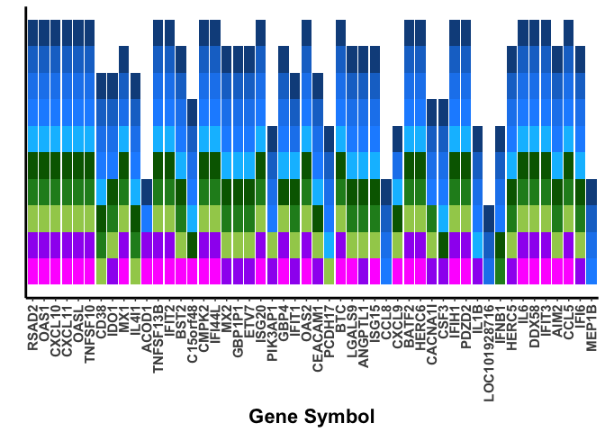

Human top 50 overlap
================

Purpose
-------

Assess the top 50 upregulated genes in humans and determine whether they are also upregulated in the other species (log2FoldChange &gt; 0).

``` r
library(reshape2)
library(ggplot2)
library(gage)
library(gageData)
library(dplyr)
library(tibble)
library(stringr)
library(gplots)
library(viridis)
library(RColorBrewer)
```

Upload DGE files for the species

``` r
DGE_files <- "DGE_per_species"
sampleFiles <- basename(Sys.glob(file.path(DGE_files,  "*results.txt")))
sampleNames <- sub('-treated_vs_mock_analysis_results.txt', '', sampleFiles)
length(sampleFiles)
```

    ## [1] 10

``` r
species_match <- str_match(sampleFiles, '(\\w+[\\s]?\\w+)')
species <- species_match[,2]
species
```

    ##  [1] "Bonobo"            "Chimpanzee"        "Gorilla"          
    ##  [4] "Human"             "Mouse"             "Olive baboon"     
    ##  [7] "Orangutan"         "Pigtailed macaque" "Rhesus macaque"   
    ## [10] "Squirrel monkey"

``` r
output_dir <- "Human_top50_output"
dir.create(output_dir, showWarnings = FALSE)
```

Function to filter the data to match what is included in the pseudoviolin plots (i.e. padj &lt;= 0.05 and has an ENTREZ ID)

``` r
cleanedup_DGE <- function(files) {     
  d <- read.delim(files)
  dd <-dplyr::select(d, log2FoldChange, padj, ENTREZID, SYMBOL, X) %>%
    na.omit(padj, ENTREZID, log2FoldChange) %>%
    dplyr::filter(padj <= 0.05) %>%
    dplyr::distinct(ENTREZID, .keep_all = TRUE) %>%
    dplyr::select(log2FoldChange, SYMBOL, ENTREZID, X) %>%
    arrange(desc(log2FoldChange)) %>%
    mutate(SYMBOL = as.character(SYMBOL))
}
```

Run the function for all the NHP species

``` r
DGEs <- lapply(file.path(DGE_files, sampleFiles[c(1:4, 6:10)]), cleanedup_DGE)
names(DGEs) <- sampleNames[c(1:4, 6:10)]
```

Pull out the top 50 of human into a data frame

``` r
human <- lapply(DGEs[4], data.frame)
human_df <- do.call("cbind", human) %>%
  slice(1:50) %>%
  rename(SYMBOL = Human.SYMBOL, X = Human.X) %>%
  droplevels() %>%
  mutate(SYMBOL = as.character(SYMBOL))
human_df
```

    ## # A tibble: 50 x 4
    ##    Human.log2FoldChange  SYMBOL Human.ENTREZID               X
    ##                   <dbl>   <chr>         <fctr>          <fctr>
    ##  1            10.576453   RSAD2          91543 ENSG00000134321
    ##  2            10.467416    OAS1           4938 ENSG00000089127
    ##  3            10.210544  CXCL10           3627 ENSG00000169245
    ##  4            10.206683  CXCL11           6373 ENSG00000169248
    ##  5            10.010123    OASL           8638 ENSG00000135114
    ##  6             9.968366 TNFSF10           8743 ENSG00000121858
    ##  7             9.654012    CD38            952 ENSG00000004468
    ##  8             9.539248    IDO1           3620 ENSG00000131203
    ##  9             9.386738     MX1           4599 ENSG00000157601
    ## 10             9.339168   IL4I1         259307 ENSG00000104951
    ## # ... with 40 more rows

Now to add mouse in to the mix and compare to the top 50 upregulated genes in human.

``` r
##To compare to mouse, slightly more complicated!
##Import the mouse file and convert the symbols used all to uppercase
mouse_DGE <- lapply(file.path(DGE_files, sampleFiles[c(5)]), cleanedup_DGE)
mouse_df <- do.call("cbind", mouse_DGE)
mouse_df$SYMBOL <- toupper(mouse_df$SYMBOL) 
mouse_df <- rename(mouse_df, Mouse.SYMBOL = SYMBOL)

##Now upload the file of orthologs from BioMart (i.e. mouse ENSEMBL ID matched with its human ENSEMBL ID) 
orthologs <- read.delim("MousevHumanOrthos.txt", header = TRUE) %>%
  rename(X = Gene.stable.ID) 

##Have to rename the mouse ENSEMBL ID column now to X to compare to the original mouse DGE profile
mouse_hum_orthos <- left_join(human_df, orthologs, by = "X") %>%
  select(SYMBOL, Mouse.gene.stable.ID, Mouse.homology.type) %>%
  rename(X = Mouse.gene.stable.ID)
```

    ## Warning: Column `X` joining factors with different levels, coercing to
    ## character vector

``` r
head(mouse_hum_orthos)
```

    ## # A tibble: 6 x 3
    ##   SYMBOL                  X Mouse.homology.type
    ##    <chr>             <fctr>              <fctr>
    ## 1  RSAD2 ENSMUSG00000020641    ortholog_one2one
    ## 2  RSAD2 ENSMUSG00000020641    ortholog_one2one
    ## 3  RSAD2 ENSMUSG00000020641    ortholog_one2one
    ## 4  RSAD2 ENSMUSG00000020641    ortholog_one2one
    ## 5  RSAD2 ENSMUSG00000020641    ortholog_one2one
    ## 6   OAS1 ENSMUSG00000032623   ortholog_one2many

``` r
##As seen here, there are numerous instances where the mouse gene comes up as NA for subsequent columns - i.e. was filtered out earlier based off padj <=0.05 and/or missing log2FoldChange values, etc. The table shown also demonstrates the difference in some of the gene SYMBOLs as well as the varying homology type for some of the genes listed (for example, OAS1 murine orthologs are one to many with Oas1a, 1b, etc.).
mouse_limited <- left_join(mouse_hum_orthos, mouse_df, by = "X") 
```

    ## Warning: Column `X` joining factors with different levels, coercing to
    ## character vector

``` r
mouse_limited
```

    ## # A tibble: 385 x 6
    ##    SYMBOL                  X Mouse.homology.type log2FoldChange
    ##     <chr>              <chr>              <fctr>          <dbl>
    ##  1  RSAD2 ENSMUSG00000020641    ortholog_one2one       8.294807
    ##  2  RSAD2 ENSMUSG00000020641    ortholog_one2one       8.294807
    ##  3  RSAD2 ENSMUSG00000020641    ortholog_one2one       8.294807
    ##  4  RSAD2 ENSMUSG00000020641    ortholog_one2one       8.294807
    ##  5  RSAD2 ENSMUSG00000020641    ortholog_one2one       8.294807
    ##  6   OAS1 ENSMUSG00000032623   ortholog_one2many             NA
    ##  7   OAS1 ENSMUSG00000032623   ortholog_one2many             NA
    ##  8   OAS1 ENSMUSG00000032623   ortholog_one2many             NA
    ##  9   OAS1 ENSMUSG00000032623   ortholog_one2many             NA
    ## 10   OAS1 ENSMUSG00000032623   ortholog_one2many             NA
    ## # ... with 375 more rows, and 2 more variables: Mouse.SYMBOL <chr>,
    ## #   ENTREZID <fctr>

``` r
##To show which human symbols (originated as human ENSEMBL ID when I did the join above) from our orthologs list had no murine ortholog. These instances will be indicated on the final figure as not having a murine ortholog based off our database list. 
no_ortho <- filter(mouse_limited, is.na(X))
no_ortho
```

    ## # A tibble: 8 x 6
    ##         SYMBOL     X Mouse.homology.type log2FoldChange Mouse.SYMBOL
    ##          <chr> <chr>              <fctr>          <dbl>        <chr>
    ## 1          MX2  <NA>                  NA             NA         <NA>
    ## 2       GBP1P1  <NA>                  NA             NA         <NA>
    ## 3         ETV7  <NA>                  NA             NA         <NA>
    ## 4        IFIT1  <NA>                  NA             NA         <NA>
    ## 5         CCL8  <NA>                  NA             NA         <NA>
    ## 6 LOC101928716  <NA>                  NA             NA         <NA>
    ## 7        HERC5  <NA>                  NA             NA         <NA>
    ## 8         IFI6  <NA>                  NA             NA         <NA>
    ## # ... with 1 more variables: ENTREZID <fctr>

``` r
##To pull out all distinct mouse ENSEMBL IDs in this list.
##Note that anything with an NA is across the board for log2FoldChange, mouse SYMBOL, and mouse ENTREZ ID.
##Thus, these latter instances, there is an ortholog, but by our filter of the murine DGE profile, the gene
##for all intents and purposes did not change expression based off this filter. 
mouse_distinct <- distinct(mouse_limited, X, .keep_all = TRUE) %>%
  filter(!is.na(X))
mouse_distinct
```

    ## # A tibble: 54 x 6
    ##    SYMBOL                  X Mouse.homology.type log2FoldChange
    ##     <chr>              <chr>              <fctr>          <dbl>
    ##  1  RSAD2 ENSMUSG00000020641    ortholog_one2one       8.294807
    ##  2   OAS1 ENSMUSG00000032623   ortholog_one2many             NA
    ##  3   OAS1 ENSMUSG00000029605   ortholog_one2many             NA
    ##  4   OAS1 ENSMUSG00000001168   ortholog_one2many             NA
    ##  5   OAS1 ENSMUSG00000066867   ortholog_one2many             NA
    ##  6   OAS1 ENSMUSG00000052776   ortholog_one2many       6.191997
    ##  7   OAS1 ENSMUSG00000066861   ortholog_one2many       7.556869
    ##  8   OAS1 ENSMUSG00000053765   ortholog_one2many             NA
    ##  9   OAS1 ENSMUSG00000001166   ortholog_one2many       3.008639
    ## 10 CXCL10 ENSMUSG00000034855    ortholog_one2one       8.563931
    ## # ... with 44 more rows, and 2 more variables: Mouse.SYMBOL <chr>,
    ## #   ENTREZID <fctr>

``` r
##So from the table above we can now get rid of all the NA values.
mouse_distinct_cleaned <- na.omit(mouse_distinct)
mouse_distinct_cleaned
```

    ## # A tibble: 35 x 6
    ##     SYMBOL                  X Mouse.homology.type log2FoldChange
    ##      <chr>              <chr>              <fctr>          <dbl>
    ##  1   RSAD2 ENSMUSG00000020641    ortholog_one2one       8.294807
    ##  2    OAS1 ENSMUSG00000052776   ortholog_one2many       6.191997
    ##  3    OAS1 ENSMUSG00000066861   ortholog_one2many       7.556869
    ##  4    OAS1 ENSMUSG00000001166   ortholog_one2many       3.008639
    ##  5  CXCL10 ENSMUSG00000034855    ortholog_one2one       8.563931
    ##  6  CXCL11 ENSMUSG00000060183    ortholog_one2one       6.771402
    ##  7    OASL ENSMUSG00000041827    ortholog_one2one       7.581560
    ##  8 TNFSF10 ENSMUSG00000039304    ortholog_one2one       2.575341
    ##  9     MX1 ENSMUSG00000000386   ortholog_one2many       7.906548
    ## 10     MX1 ENSMUSG00000023341   ortholog_one2many       6.996945
    ## # ... with 25 more rows, and 2 more variables: Mouse.SYMBOL <chr>,
    ## #   ENTREZID <fctr>

``` r
##Now we want to highlight the ones that have multiple murine orthologs expressed to indicate in our figure. 
##These will be marked as one to many or many to many orthologs.
mouse_multis <-  group_by(mouse_distinct_cleaned, SYMBOL) %>%
  filter(n() > 1)
mouse_multis
```

    ## # A tibble: 9 x 6
    ## # Groups:   SYMBOL [4]
    ##   SYMBOL                  X Mouse.homology.type log2FoldChange
    ##    <chr>              <chr>              <fctr>          <dbl>
    ## 1   OAS1 ENSMUSG00000052776   ortholog_one2many       6.191997
    ## 2   OAS1 ENSMUSG00000066861   ortholog_one2many       7.556869
    ## 3   OAS1 ENSMUSG00000001166   ortholog_one2many       3.008639
    ## 4    MX1 ENSMUSG00000000386   ortholog_one2many       7.906548
    ## 5    MX1 ENSMUSG00000023341   ortholog_one2many       6.996945
    ## 6   GBP4 ENSMUSG00000040253  ortholog_many2many       4.521071
    ## 7   GBP4 ENSMUSG00000028268  ortholog_many2many       6.796664
    ## 8  IFIT3 ENSMUSG00000074896   ortholog_one2many       7.219538
    ## 9  IFIT3 ENSMUSG00000062488   ortholog_one2many       6.813693
    ## # ... with 2 more variables: Mouse.SYMBOL <chr>, ENTREZID <fctr>

``` r
##Also want to highlight instances where the human SYMBOL does not equal the murine SYMBOL for additional detail on our figure. 
mouse_diff_SYMBOL <- filter(mouse_distinct_cleaned, SYMBOL != Mouse.SYMBOL)
mouse_diff_SYMBOL
```

    ## # A tibble: 10 x 6
    ##      SYMBOL                  X Mouse.homology.type log2FoldChange
    ##       <chr>              <chr>              <fctr>          <dbl>
    ##  1     OAS1 ENSMUSG00000052776   ortholog_one2many       6.191997
    ##  2     OAS1 ENSMUSG00000066861   ortholog_one2many       7.556869
    ##  3     OAS1 ENSMUSG00000001166   ortholog_one2many       3.008639
    ##  4     OASL ENSMUSG00000041827    ortholog_one2one       7.581560
    ##  5      MX1 ENSMUSG00000023341   ortholog_one2many       6.996945
    ##  6    ACOD1 ENSMUSG00000022126    ortholog_one2one       7.129036
    ##  7 C15orf48 ENSMUSG00000033213    ortholog_one2one       2.190407
    ##  8     GBP4 ENSMUSG00000040253  ortholog_many2many       4.521071
    ##  9     GBP4 ENSMUSG00000028268  ortholog_many2many       6.796664
    ## 10    IFIT3 ENSMUSG00000062488   ortholog_one2many       6.813693
    ## # ... with 2 more variables: Mouse.SYMBOL <chr>, ENTREZID <fctr>

``` r
##Now putting together the final table of human genes with a murine ortholog (of any homology type) that had an increase in expression and thus will be shown in our figure as +1 for mouse. Anything that doesn't match up will show as NA and thus count as +0 in the figure and will be noted specifically if it is because there wasn't an ortholog, or there is an ortholog but no expression, or etc. 
mouse_final_tally <- distinct(mouse_distinct_cleaned, SYMBOL, .keep_all = TRUE) %>%
  select(SYMBOL, log2FoldChange) %>%
  ##so you can perform the join on the same column name
  rename(Gene = SYMBOL, Mouse = log2FoldChange)
```

Now to actually assess the top 50 upregulated genes in human in comparison with the mouse and NHP donors

``` r
##Function to see which of the top 50 human genes are found in the NHP donors. For the final graph, a stacked bar graph, a gene that has a log2FoldChange > 0 will be marked as a 1 and those that are NA or below 0, will be marked as 0. 
matched_DGEs <- function(files) {     
  a <- left_join(human_df, files, by = "SYMBOL") %>%
    select(SYMBOL, log2FoldChange) %>% 
    mutate(log2FoldChange = replace(log2FoldChange, log2FoldChange<0, 0)) %>%
    mutate(log2FoldChange = replace(log2FoldChange, log2FoldChange>0, 1)) %>%
    mutate(log2FoldChange = replace(log2FoldChange, is.na(log2FoldChange), 0))
}

##Applying the function over the filtered NHP DGE profiles made above.
matched <- lapply(DGEs, matched_DGEs)

##Turning "matched" into a data frame
matched_df <- do.call("cbind", matched) %>%
  select(ends_with("log2FoldChange"), Human.SYMBOL) %>%
  rename(Gene = Human.SYMBOL)

##Taking matched_df, which only contains the NHP donors matched up to the human top 50 genes, and now adding in the mouse_final_tally.
matched_all <- left_join(matched_df, mouse_final_tally, by = "Gene") %>%
      mutate(Mouse = replace(Mouse, Mouse>0, 1)) %>%
    mutate(Mouse = replace(Mouse, is.na(Mouse), 0))

##Determining the number of genes in the human top 50 that were also marked as a log2Foldchange >0 for all the other NHP species.
summing <- select(matched_all, 1:9) %>%
  mutate(sum = rowSums(.)) %>%
  filter(sum == 9)

nrow(summing)
```

    ## [1] 27

Plotting the stacked bar graph of the final assessment

``` r
##Melting the matched_all made above to prepare for plotting
matched_all.m <- melt(matched_all)
```

    ## Using Gene as id variables

``` r
##Putting the donors in evolutionary order starting from human
matched_all.m$variable <- factor(matched_all.m$variable, 
                                levels = c("Human.log2FoldChange", "Chimpanzee.log2FoldChange",  "Bonobo.log2FoldChange", "Gorilla.log2FoldChange", "Orangutan.log2FoldChange", "Olive baboon.log2FoldChange", "Rhesus macaque.log2FoldChange", "Pigtailed macaque.log2FoldChange", "Squirrel monkey.log2FoldChange", "Mouse"))

##This keeps the order of the genes based off human, with the most upregulted gene first followed by the next 49 in decreasing order. 
matched_all.m$Gene <- factor(matched_all.m$Gene, levels = unique(matched_all.m$Gene))

##Plotting the data.
a <- ggplot(matched_all.m, aes(x = Gene, y = value, fill = variable)) +
  geom_bar(stat="identity") + 
  theme(axis.line = element_line(colour = "black", 
                      size = 1, linetype = "solid")) +
  xlab("Gene Symbol") + ylab ("") +
  theme(panel.background = element_rect(fill = "white"), 
        legend.position = "none",
        panel.grid.major = element_blank()) +
  theme(axis.text.x = element_text(angle = 90, vjust = 0.5, hjust = 1, face = "bold", family = "Arial", size = rel(1.3)), axis.title.x = element_text(face = "bold", family = "Arial", size = rel(1.5)), axis.ticks.y = element_blank(), axis.text.y = element_blank()) + 
scale_color_manual(values= c("dodgerblue4", "dodgerblue3", "dodgerblue2", "dodgerblue1", "deepskyblue", "darkgreen", "forestgreen", "darkolivegreen3", "purple", "magenta")) +
  scale_fill_manual(values= c("dodgerblue4", "dodgerblue3", "dodgerblue2", "dodgerblue1", "deepskyblue", "darkgreen", "forestgreen", "darkolivegreen3", "purple", "magenta")) 
a
```



``` r
##Saving the image 
ggsave(file = file.path(output_dir, paste(Sys.Date(), "Top50overlap.png")), plot = a, units = 'in', height = 5, width = 10, dpi = 300, device = "png")
dev.off()
```

    ## null device 
    ##           1

Session Info

``` r
sessionInfo()
```

    ## R version 3.3.3 (2017-03-06)
    ## Platform: x86_64-apple-darwin13.4.0 (64-bit)
    ## Running under: macOS Sierra 10.12.6
    ## 
    ## locale:
    ## [1] en_US.UTF-8/en_US.UTF-8/en_US.UTF-8/C/en_US.UTF-8/en_US.UTF-8
    ## 
    ## attached base packages:
    ## [1] stats     graphics  grDevices utils     datasets  methods   base     
    ## 
    ## other attached packages:
    ##  [1] bindrcpp_0.2       RColorBrewer_1.1-2 viridis_0.4.0     
    ##  [4] viridisLite_0.2.0  gplots_3.0.1       stringr_1.2.0     
    ##  [7] tibble_1.3.3       dplyr_0.7.3        gageData_2.10.0   
    ## [10] gage_2.22.0        ggplot2_2.2.1      reshape2_1.4.2    
    ## 
    ## loaded via a namespace (and not attached):
    ##  [1] KEGGREST_1.12.3      gtools_3.5.0         colorspace_1.3-2    
    ##  [4] htmltools_0.3.5      stats4_3.3.3         yaml_2.1.14         
    ##  [7] rlang_0.1.2          glue_1.1.1           DBI_0.6-1           
    ## [10] BiocGenerics_0.18.0  plyr_1.8.4           bindr_0.1           
    ## [13] zlibbioc_1.18.0      Biostrings_2.40.2    munsell_0.4.3       
    ## [16] gtable_0.2.0         caTools_1.17.1       memoise_1.0.0       
    ## [19] evaluate_0.10        labeling_0.3         Biobase_2.32.0      
    ## [22] knitr_1.16           IRanges_2.6.1        parallel_3.3.3      
    ## [25] AnnotationDbi_1.34.4 Rcpp_0.12.10         KernSmooth_2.23-15  
    ## [28] scales_0.4.1         backports_1.0.5      gdata_2.17.0        
    ## [31] S4Vectors_0.10.3     graph_1.50.0         XVector_0.12.1      
    ## [34] gridExtra_2.2.1      png_0.1-7            digest_0.6.12       
    ## [37] stringi_1.1.5        grid_3.3.3           rprojroot_1.2       
    ## [40] tools_3.3.3          bitops_1.0-6         magrittr_1.5        
    ## [43] lazyeval_0.2.0       RSQLite_1.1-2        pkgconfig_2.0.1     
    ## [46] assertthat_0.2.0     rmarkdown_1.4        httr_1.2.1          
    ## [49] R6_2.2.0
