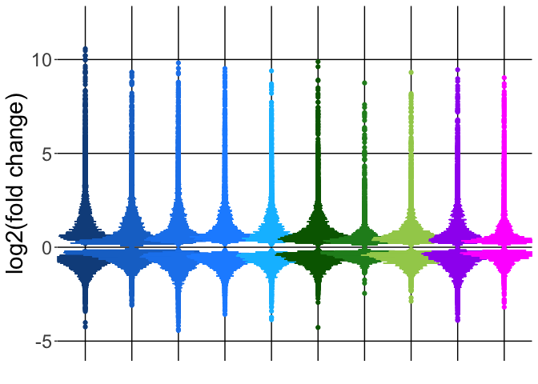

Pseudoviolin plots
================

Purpose
-------

Generating pseudoviolin plots of the differentially expressed genes across all the species used in this study.

``` r
library(dplyr)
library(stringr)
library(ggplot2)
library(reshape2)
```

Upload differential gene expression files

``` r
DGE_files <- "DGE_per_species"
sampleFiles <- basename(Sys.glob(file.path(DGE_files,  "*results.txt")))
sampleNames <- sub('-treated_vs_mock_analysis_results.txt', '', sampleFiles)
length(sampleFiles)
```

    ## [1] 10

``` r
species_match <- str_match(sampleFiles, '(\\w+[\\s]?\\w+)')
species <- species_match[,2]
species
```

    ##  [1] "Bonobo"            "Chimpanzee"        "Gorilla"          
    ##  [4] "Human"             "Mouse"             "Olive baboon"     
    ##  [7] "Orangutan"         "Pigtailed macaque" "Rhesus macaque"   
    ## [10] "Squirrel monkey"

``` r
output_dir <- "Pseudoviolin_output"
dir.create(output_dir, showWarnings = FALSE)
```

Organize the data and select only genes that have an ENTREZ ID (since this is one of the requirements for performing the pathway analysis) AND a padj &lt;= 0.05 to use for generating the pseudoviolin plots .

``` r
data_pseudoviolins <- function(files) {     
  d <- read.delim(files)
  dd <-dplyr::select(d, log2FoldChange, padj, ENTREZID) %>%
    na.omit() %>%
    dplyr::filter(padj <= 0.05) %>%
    dplyr::distinct(ENTREZID, .keep_all = TRUE) %>%
    dplyr::select(log2FoldChange) 
}

p <- lapply(file.path(DGE_files, sampleFiles), data_pseudoviolins)
names(p) <- species
p_renamed <- lapply(names(p), function(x) setNames(p[[x]], x) )
names(p_renamed) <- species

p_renamed.m <- lapply(p_renamed, melt)
```

    ## No id variables; using all as measure variables
    ## No id variables; using all as measure variables
    ## No id variables; using all as measure variables
    ## No id variables; using all as measure variables
    ## No id variables; using all as measure variables
    ## No id variables; using all as measure variables
    ## No id variables; using all as measure variables
    ## No id variables; using all as measure variables
    ## No id variables; using all as measure variables
    ## No id variables; using all as measure variables

``` r
all_combined <- data.table::rbindlist(p_renamed.m)
all_combined$variable <- factor(all_combined$variable, 
                                levels = c("Human", "Chimpanzee", "Bonobo", "Gorilla", 
                                           "Orangutan", "Olive baboon", "Rhesus macaque", 
                                           "Pigtailed macaque", "Squirrel monkey","Mouse"))

##Get the number of values (i.e. the genes included in the pseudoviolin plots) for each 
##species. 
freq_numbers <- count(all_combined, variable)
freq_numbers
```

    ## # A tibble: 10 x 2
    ##             variable     n
    ##               <fctr> <int>
    ##  1             Human  6341
    ##  2        Chimpanzee  9150
    ##  3            Bonobo  7136
    ##  4           Gorilla  6663
    ##  5         Orangutan  5787
    ##  6      Olive baboon  7159
    ##  7    Rhesus macaque  4671
    ##  8 Pigtailed macaque  6705
    ##  9   Squirrel monkey  6572
    ## 10             Mouse  5161

``` r
##Now if wanting to see how many genes included in the pseudoviolin plots have a ##log2FoldChange >= 1 or <= -1.
p_greater <- lapply(p, function(x) x[x[, 1] >= 1, ])
sapply(p_greater, length)
```

    ##            Bonobo        Chimpanzee           Gorilla             Human 
    ##              1593              1574              1526              1680 
    ##             Mouse      Olive baboon         Orangutan Pigtailed macaque 
    ##               719              1336              1310               901 
    ##    Rhesus macaque   Squirrel monkey 
    ##               295              1226

``` r
p_lesser <- lapply(p, function(x) x[x[, 1] <= -1, ])
sapply(p_lesser, length)
```

    ##            Bonobo        Chimpanzee           Gorilla             Human 
    ##              1234               637               927              1120 
    ##             Mouse      Olive baboon         Orangutan Pigtailed macaque 
    ##               357               719               651               540 
    ##    Rhesus macaque   Squirrel monkey 
    ##               101              1069

Plotting the human and NHP plots

``` r
all_plot <- ggplot(all_combined, aes(x = variable, y = value, fill= variable, color=variable)) + geom_point() 
total_plot <- all_plot + geom_dotplot(binwidth=.07, binaxis = "y", stackdir="center", dotsize = 0.20) + 
  xlab("") + ylab ("log2(fold change)") + 
  theme(panel.background = element_rect(fill = "white"), 
        panel.grid.major = element_line(colour = "black")) +
  theme(axis.ticks.x=element_blank(), axis.text.x = element_blank(), 
        axis.text.y = element_text(size = rel(2)), axis.title.y = element_text(size = rel(2)),
        legend.position = "none") + ylim(-5.2, 12) +
  scale_color_manual(values= c("dodgerblue4", "dodgerblue3", "dodgerblue2", "dodgerblue1", "deepskyblue", "darkgreen", "forestgreen", "darkolivegreen3", "purple", "magenta")) +
  scale_fill_manual(values= c("dodgerblue4", "dodgerblue3", "dodgerblue2", "dodgerblue1", "deepskyblue", "darkgreen", "forestgreen", "darkolivegreen3", "purple", "magenta")) 
total_plot
```



``` r
ggsave(filename = file.path(output_dir, paste(Sys.Date(), "all species pseudoviolin.png")),
       plot = total_plot, dpi = 300, width = 17, height = 6, units = "in", device = "png")
```

Taking the pseudoviolin plot data and making files of all the transcripts for each species as well as a separate file giving the top 50 or the top 10 transcripts that had the highest increase in expression between mock and polyI:C transfection.

``` r
tables_pseudoviolins <- function(files) {     
  d <- read.delim(files)
  dd <-dplyr::select(d, log2FoldChange, padj, ENTREZID, SYMBOL) %>%
    na.omit() %>%
    dplyr::filter(padj <= 0.05) %>%
    arrange(desc(log2FoldChange)) 
}

data_tables <- lapply(file.path(DGE_files, sampleFiles), tables_pseudoviolins)
names(data_tables) <- species

for (i in names(data_tables)){
  filename <- paste(i, "pseudoviolin gene list", sep="")
  write.table(data_tables[[i]], file = file.path(output_dir, filename),row.names=FALSE,sep="\t",quote=FALSE)
}

topten <- lapply(data_tables, '[', 1:10,)
topten_df <- do.call("cbind", topten) %>%
  select(ends_with("SYMBOL"))
topten_df
```

    ##    Bonobo.SYMBOL Chimpanzee.SYMBOL Gorilla.SYMBOL Human.SYMBOL
    ## 1         CXCL11              OASL           OASL        RSAD2
    ## 2         CXCL10             RSAD2         CXCL11         OAS1
    ## 3           CCL8              IDO1           IDO1       CXCL10
    ## 4          CXCL9             HERC6          ARMC3       CXCL11
    ## 5           IDO1               MX1         CXCL10         OASL
    ## 6           OASL              OAS1         LGALS9      TNFSF10
    ## 7          CCL20              OAS2          IFIT2         CD38
    ## 8        TNFSF10           TNFSF10        TNFSF10         IDO1
    ## 9          CXCL8              OAS3          RSAD2          MX1
    ## 10      C15orf48             IFI27            RET        IL4I1
    ##    Mouse.SYMBOL Olive baboon.SYMBOL Orangutan.SYMBOL
    ## 1  H2-Q8, H2-Q6                OASL            CXCL9
    ## 2         Cxcl9              CXCL11            HERC5
    ## 3        Cxcl10                OAS1             OASL
    ## 4         Rsad2                OAS2            IFIH1
    ## 5          Oas3               HERC5           CXCL11
    ## 6          Ccl5                BST2           CXCL10
    ## 7         Ifi44               USP18            IFIT1
    ## 8         Mpeg1               IFI44            HERC6
    ## 9           Mx1                IDO1            RSAD2
    ## 10        H2-Q7              IFIT1B             RTP4
    ##    Pigtailed macaque.SYMBOL Rhesus macaque.SYMBOL Squirrel monkey.SYMBOL
    ## 1                       MX1                   MX1                 ELAVL2
    ## 2                      OAS1                 IFIT1                    RET
    ## 3                    IFIT1B                  OAS2                   CCL5
    ## 4                      IDO1                 HERC5                   GBP5
    ## 5                     HERC6                 HERC6                  VCAM1
    ## 6                     RSAD2                  OASL                   CCL2
    ## 7                     HERC5                IFIT1B                  RSAD2
    ## 8                     IFIT1                 DDX60                  KIF5C
    ## 9                     CMPK2                IFI44L                 EPSTI1
    ## 10                   CXCL11                CXCL10                  IFIT3

``` r
write.table(topten_df, file = file.path(output_dir, paste(Sys.Date(), "top10allspecies.txt")), row.names=FALSE, sep="\t", quote=FALSE)

topfifty <- lapply(data_tables, '[', 1:50,)
topfifty_df <- do.call("cbind", topfifty) %>%
  select(ends_with("SYMBOL"))
write.table(topfifty_df, file = file.path(output_dir, paste(Sys.Date(), "top50allspecies.txt")), row.names=FALSE, sep="\t", quote=FALSE)
```

``` r
sessionInfo()
```

    ## R version 3.3.3 (2017-03-06)
    ## Platform: x86_64-apple-darwin13.4.0 (64-bit)
    ## Running under: macOS Sierra 10.12.6
    ## 
    ## locale:
    ## [1] en_US.UTF-8/en_US.UTF-8/en_US.UTF-8/C/en_US.UTF-8/en_US.UTF-8
    ## 
    ## attached base packages:
    ## [1] stats     graphics  grDevices utils     datasets  methods   base     
    ## 
    ## other attached packages:
    ## [1] bindrcpp_0.2   reshape2_1.4.2 ggplot2_2.2.1  stringr_1.2.0 
    ## [5] dplyr_0.7.3    knitr_1.16    
    ## 
    ## loaded via a namespace (and not attached):
    ##  [1] Rcpp_0.12.10      bindr_0.1         magrittr_1.5     
    ##  [4] munsell_0.4.3     colorspace_1.3-2  R6_2.2.0         
    ##  [7] rlang_0.1.2       plyr_1.8.4        tools_3.3.3      
    ## [10] grid_3.3.3        data.table_1.10.0 gtable_0.2.0     
    ## [13] htmltools_0.3.5   lazyeval_0.2.0    yaml_2.1.14      
    ## [16] assertthat_0.2.0  rprojroot_1.2     digest_0.6.12    
    ## [19] tibble_1.3.3      glue_1.1.1        evaluate_0.10    
    ## [22] rmarkdown_1.4     labeling_0.3      stringi_1.1.5    
    ## [25] scales_0.4.1      backports_1.0.5   pkgconfig_2.0.1
